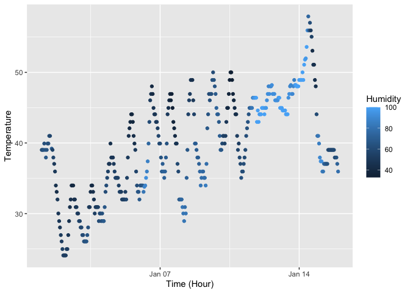

p8105_hw1_hc3451
================
Huanyu Chen
2023-09-20

# Problem 1

``` r
# Analyze Dataset
data("early_january_weather")
names(early_january_weather)
```

    ##  [1] "origin"     "year"       "month"      "day"        "hour"      
    ##  [6] "temp"       "dewp"       "humid"      "wind_dir"   "wind_speed"
    ## [11] "wind_gust"  "precip"     "pressure"   "visib"      "time_hour"

``` r
nrow(early_january_weather)
```

    ## [1] 358

``` r
ncol(early_january_weather)
```

    ## [1] 15

``` r
mean(early_january_weather$temp)
```

    ## [1] 39.58212

**The variables in this dataset includes: year, month, day, etc. with
the value of int; temp, dewp, humid, etc. with the value of dbl. This
dataset has 358 rows and 15 columns. The mean temperature is
39.5821229.**

``` r
head(early_january_weather)
```

    ## # A tibble: 6 × 15
    ##   origin  year month   day  hour  temp  dewp humid wind_dir wind_speed wind_gust
    ##   <chr>  <int> <int> <int> <int> <dbl> <dbl> <dbl>    <dbl>      <dbl>     <dbl>
    ## 1 EWR     2013     1     1     1  39.0  26.1  59.4      270      10.4         NA
    ## 2 EWR     2013     1     1     2  39.0  27.0  61.6      250       8.06        NA
    ## 3 EWR     2013     1     1     3  39.0  28.0  64.4      240      11.5         NA
    ## 4 EWR     2013     1     1     4  39.9  28.0  62.2      250      12.7         NA
    ## 5 EWR     2013     1     1     5  39.0  28.0  64.4      260      12.7         NA
    ## 6 EWR     2013     1     1     6  37.9  28.0  67.2      240      11.5         NA
    ## # ℹ 4 more variables: precip <dbl>, pressure <dbl>, visib <dbl>,
    ## #   time_hour <dttm>

``` r
# Draw & Save Scatterplot
scatter_plot <- ggplot(early_january_weather, aes(x = time_hour, y = temp, color = humid)) +
  geom_point() +
  labs(x = "Time (Hour)", y = "Temperature", color = "Humidity")
scatter_plot
```

<!-- -->

``` r
ggsave("scatterplot_temp_vs_time_hour.png", plot = scatter_plot)
```

    ## Saving 7 x 5 in image

**Both humidity and temperature fluctuate approximately the same way in
one day: during the daytime, the temperature is high and the humidity is
high, while in the evening, the temperature and humidity are generally
low.**

# Problem 2

``` r
# Create Data Frame
random_sample <- rnorm(10)
greater_0 <- random_sample > 0
character_vector <- sample(letters, 10, replace = TRUE)
factor_vector <- factor(sample(c("L1", "L2", "L3"), 10, replace = TRUE))

data_frame <- data.frame(
  random_sample, greater_0, character_vector, factor_vector)
head(data_frame)
```

    ##   random_sample greater_0 character_vector factor_vector
    ## 1     0.9309937      TRUE                i            L1
    ## 2    -1.2625382     FALSE                x            L2
    ## 3    -0.2460743     FALSE                q            L2
    ## 4    -0.9637898     FALSE                m            L3
    ## 5     0.6037700      TRUE                u            L1
    ## 6     0.1396602      TRUE                d            L1

``` r
# Calculate Mean Value
mean(pull(data_frame, random_sample))
```

    ## [1] -0.2700463

``` r
mean(pull(data_frame, greater_0))
```

    ## [1] 0.3

``` r
numeric_greater_0 <- as.numeric(pull(data_frame, greater_0))
mean(numeric_greater_0)
numeric_character_vector <- as.numeric(pull(data_frame, character_vector))
mean(numeric_character_vector)
numeric_factor_vector <- as.numeric(pull(data_frame, factor_vector))
mean(numeric_factor_vector)
```

**Mean works for numeric data types (such as random_sample), but not for
non-numeric types (such as character_vector and factor_vector). For
non-numeric types variables, converting them to numeric for mean
calculation is a possible solution but does not work every time.**
